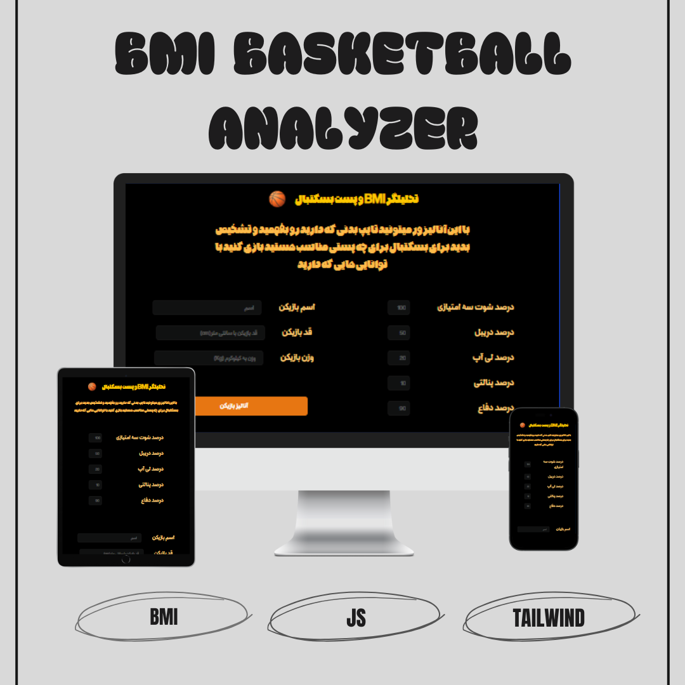
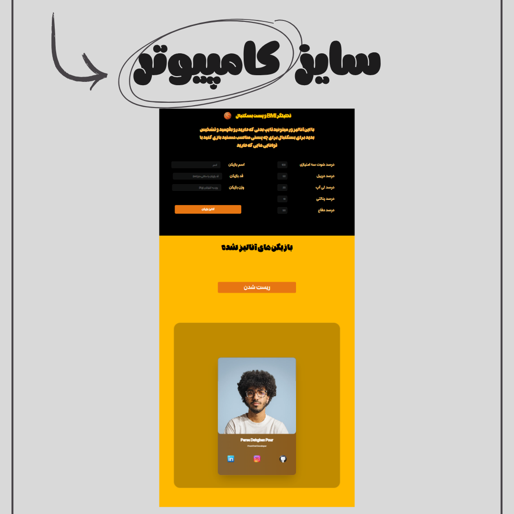
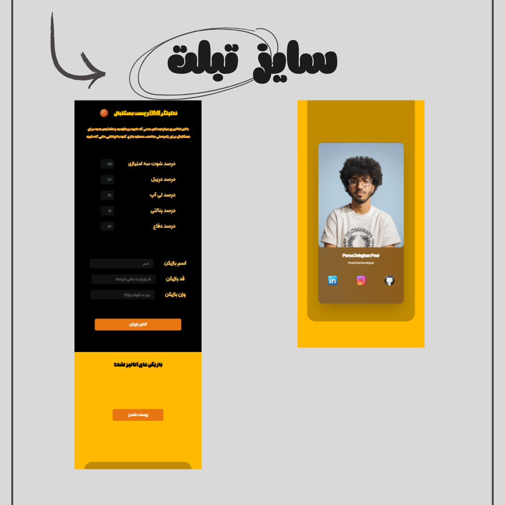
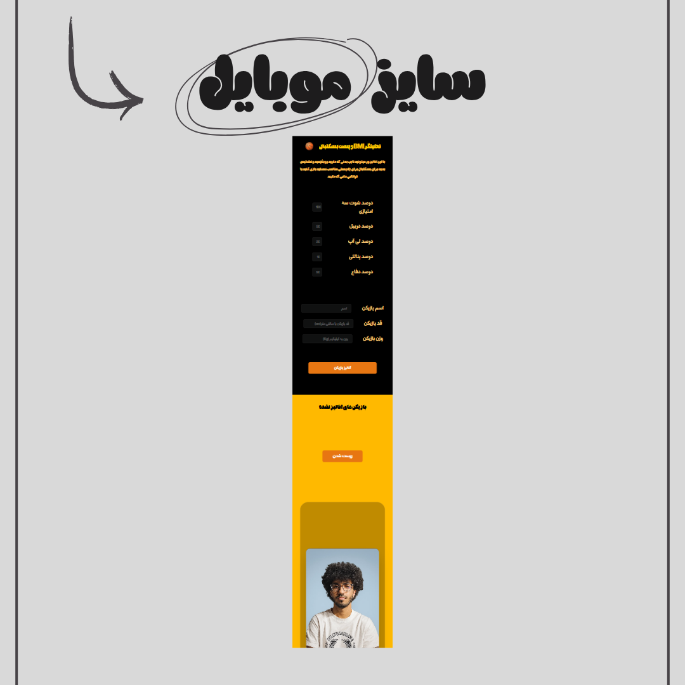

# 🏀 BMI Basketball Analyzer

**BMI Basketball Analyzer** — A smart front-end body type and position analyzer for basketball players!  
With this tool, you can calculate your **Body Mass Index (BMI)** and discover your **body type** — whether you are an **ectomorph**, **mesomorph**, or **endomorph** — and find out **which basketball position** suits your physical and athletic abilities best.  

---

## 🚀 Overview

This project helps basketball enthusiasts and players analyze their body composition and identify their ideal position on the court.  
Just enter your **height** and **weight**, and the analyzer will show:
- 💪 Your BMI (Body Mass Index)
- 🧬 Your body type (Ectomorph / Mesomorph / Endomorph)
- 🏀 The most suitable basketball position (Guard / Forward / Center)

---

## 🌐 Live Demo

👉 [View Live Demo](https://parsa-farshah.github.io/BMI-Basketball/)

---

## ✨ Features

- ⚡ Fast, lightweight, and 100% front-end
- 🧮 Accurate BMI calculation
- 🧍 Body type classification
- 🏀 Basketball position recommendation
- 🎨 Clean and responsive design

---

## 🛠️ Technologies Used

- **HTML5** – Structure and layout  
- **CSS3** – Styling and responsive UI  
- **JavaScript (Vanilla)** – Logic and BMI analysis  
- **Tailwind CSS** – Utility-first design framework  

---

## 📅 Release Date

**October 22, 2025**

---

## 👨‍💻 Developed By

**Parsa Dehghan Pour Farashah**

---

## 👨‍🏫 Project Supervisor

This project was developed under the mentorship of  
🔗 [Parsa Ghorbanian](https://trainingsitedesign.ir/)

---

## 📲 Connect with Me

- 📸 Instagram: [@parsa_dehghanpour_dv](https://www.instagram.com/parsa_dehghanpour_dv?igsh=eHkwNWhsa3I4ZWVp)
- 💼 LinkedIn: [Parsa Dehghan Pour Farashah](http://linkedin.com/in/parsa-dehghan-pour-farashah-85ab04250)
- 💻 GitHub: [parsa-farshah](https://github.com/parsa-farshah)
- 📩 Email: parsafarashah2002@gmail.com
- 📺 YouTube: [@FrontEndFresh](https://youtube.com/@frontendfresh?si=-2WsIYe-KBTUfwyu)

---

## 📸 Screenshots

🌟 Overview  

💻 Desktop View  
 

📱 Tablet View  

📱 Mobile View  

---

🏷️ **License**  
Released under the MIT License.
